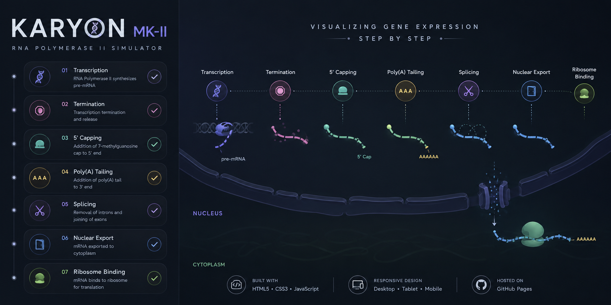

  

# 🧬 Karyon MK-II

Interactive RNA Polymerase II simulator visualizing eukaryotic transcription, mRNA processing, and gene expression.

---

## ✨ Features

* **Transcription Simulation:** Visualize RNA Polymerase II initiation, elongation, and termination.
* **mRNA Processing:** Explore 5′ capping, poly(A) tail addition, and RNA splicing.
* **Cellular Transport:** Follow mRNA export from the nucleus to ribosome binding.
* **Responsive Design:** Optimized for desktop and mobile devices.

---

## 🚀 Built & Hosting
* **Repository:** GitHub
* **Hosting:** GitHub Pages

---

## 🛠️ Credits & Acknowledgments

* **Claude Opus 4.8:** Debugging, code generation & architecture.
* **MoonShot AI:** Code improvisation & rapid prototyping.
* **Open AI:** Scientific debugging, testing & logic optimization.
---

##  Author

* **Draven Ashcroft**
  * M.Sc. Ag. Entomology, ASRB NET
  * DIPS Chain of Institutions

---

## 📜 License

GPL-3.0
